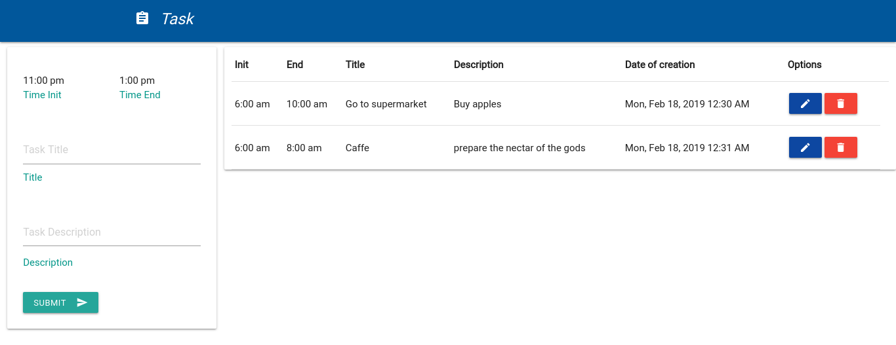
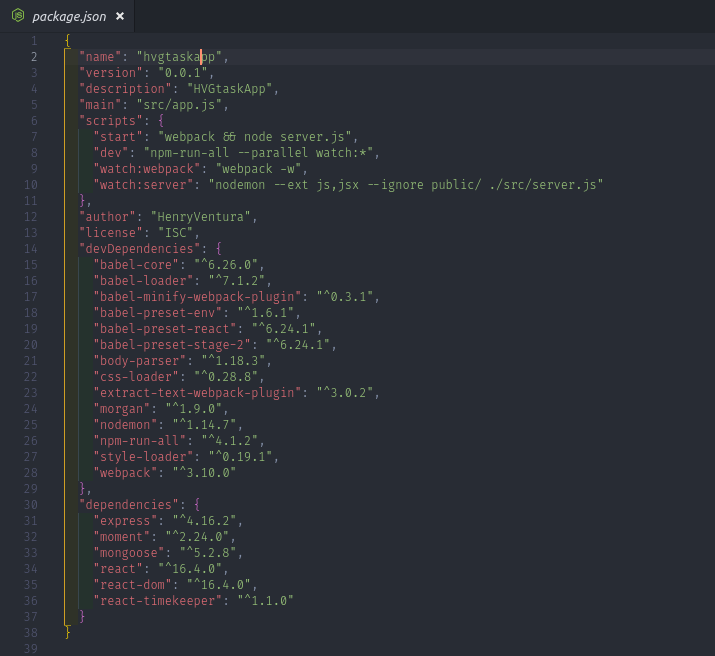

# TaskApp by HVG

Task app in React

## Installation of dependencies

```bash or fish
npm install
```

## Usage

```bash or fish
npm run start
npm run dev
```

## External dependencies

```
Node +6
Mongodb

```

## Captures





